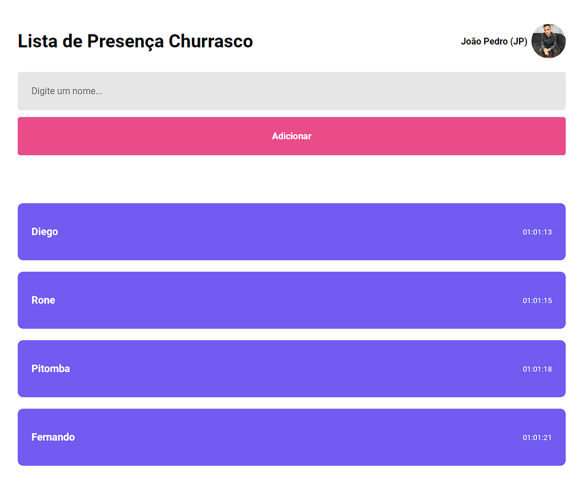

# Estudos ReactJs

> Projeto construído para estudos 🚀

**Construindo Projeto Listagem de Presença Churrasco e Consumindo API GitHub**

- Baixe o projeto

- Execute $ npm install dentro do diretório do projeto para baixar a pasta de *node_modules*

- Execute $ npm run dev após baixar a pasta *node_modules*

## Tecnologias

## Contato

:email: gsjoaopedro7@gmail.com

:telephone_receiver: (19) 99744-9537
